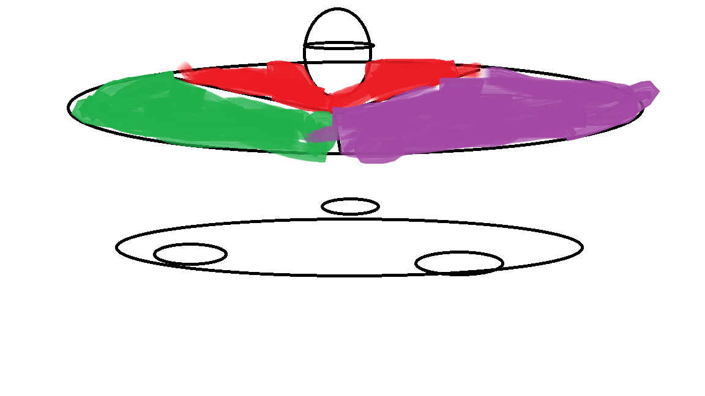
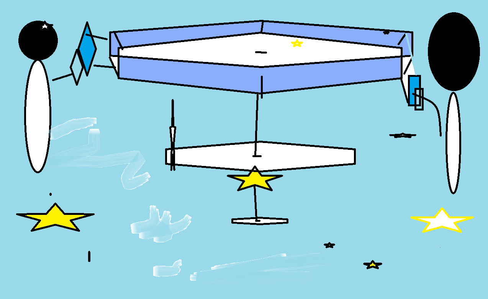
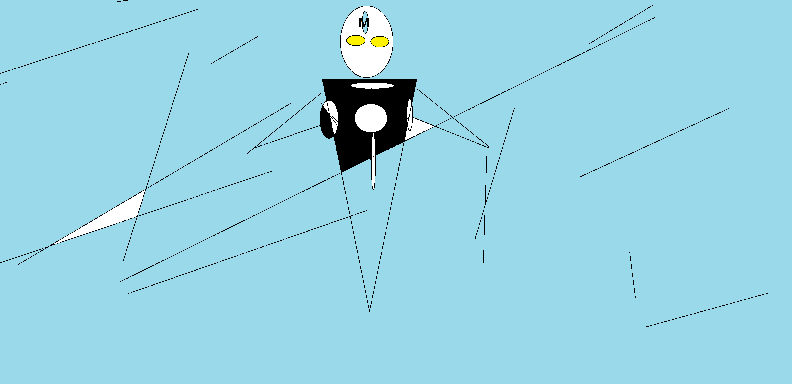

# second-understand-p23

desc:以下内容参照图理解记忆

# 一 设计模式依赖于
    类的三大特性：
        封装、继承、多态。

    对应的设计模式有三大类型：
        建造、结构、行为。
# 二、设计模式23种
## 0.概述
    建造模式【5种】    （红如火海）
    结构模式【7种】    （绿如林海）
    行为模式【11中】   （蓝如星海）

## 1.建造型
* [01单例]()
* [02原型]()
* [03工厂](src/com/example/c02structure/p01/factory.md)
* [04抽象工厂]()
* [05建造者]()

## 2.结构型
* [01门面](src/com/example/c02structure/p01/%E9%97%A8%E9%9D%A2.md)
* [02组合]()
* [03装饰器](src/com/example/c02structure/p03/%E8%A3%85%E9%A5%B0%E5%99%A8.md)
* [04适配器](src/com/example/c02structure/p04/%E9%80%82%E9%85%8D%E5%99%A8.md)
* [05享元](src/com/example/c02structure/p05/%E4%BA%AB%E5%85%83.md)
* [06代理](src/com/example/c02structure/p06/%E4%BB%A3%E7%90%86.md)
* [07桥接](src/com/example/c02structure/p07/%E6%A1%A5%E6%8E%A5.md)

## 3.行为型
* [01模板方法](src/com/example/c03behavior/p01/%E6%A8%A1%E6%9D%BF.md)
* [02迭代器](src/com/example/c03behavior/p02/%E8%BF%AD%E4%BB%A3%E5%99%A8.md)
* [03责任链](src/com/example/c03behavior/p03/%E8%B4%A3%E4%BB%BB%E9%93%BE.md)
* [04策略](src/com/example/c03behavior/p04/strategy.md)
* [05状态](src/com/example/c03behavior/p05/%E7%8A%B6%E6%80%81.md)
* [06备忘录](src/com/example/c03behavior/p06/memento.md)
* [07中介](src/com/example/c03behavior/P07/%E4%B8%AD%E4%BB%8B)
* [08命令](src/com/example/c03behavior/p08/command.md)
* [09访问者](src/com/example/c03behavior/p09/%E8%AE%BF%E9%97%AE%E8%80%85.md)
* [10观察者](src/com/example/c03behavior/p10/%E8%A7%82%E5%AF%9F%E8%80%85.md)
* [11解释器]()

# 三、软件设计原则 （设计模式之终极奥义）
* 01单一原则
* 02开闭原则
* 03里氏替换 **
* 04接口隔离
* 05依赖倒置
* 06迪米特法则