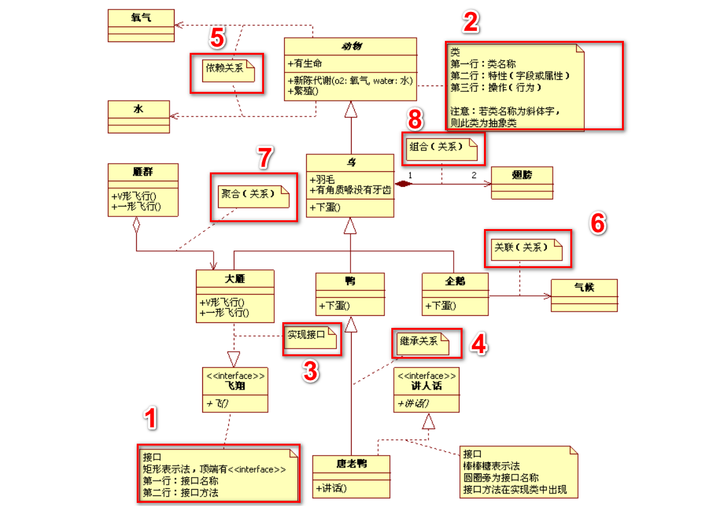

# UML类图画法

> ClassPicBase01来源：https://www.cnblogs.com/lukefan/p/10048499.html
> 
> ClassPicBase02来源：http://www.uml.org.cn/oobject/201905073.asp




## 关键词：
* 接口、类、
* 实现、继承、
* 依赖、关联、聚合、组合

## 具体解释：
1. 接口：interface

   ```
      长方形
         接口名（      <<名称>>       ）
         方法名
   ```

2. 类：class

   ```
      长方形
         类的名称（抽象类是斜体）
         类的特性（字段和属性）
         类的操作（方法或行为  +：public  -：private  #：protected）
   ```

3. 实现：implements

   ```
      空心三角+虚线
      实现谁、指向谁
      关系：has a
   ```
   
4. 继承：extends

   ```
      空心三角+实现
      继承谁、指向谁
      关系：is a
   ```
 

5. 依赖：dependency

   ```
      虚线箭头
      需要什么、就是依赖什么、指向什么
      关系：use a
   ```


6. 关联：association

   ```
      实现箭头
      比如且需要知道气候
      (强依赖的关系)
      
      （每年4月份，繁殖期，企鹅会从海洋迁移到冰面。交配产卵后、雄企冰地守护蛋、雌企鹅海洋找食物...）
   ```

7. 聚合：aggregation

   ```
      空心菱形+实现箭头
      
      箭头指向被包含的一方。
      是(弱拥有的关系)，A对象可以包含B对象，但是B对象不是A对象的一部分。
   ```

8. 组合：composition

   ```
      实心菱形+实线箭头
      
      箭头指向部分
      两端的数字是基数，表明一端的类可以有几个实例。
      (强拥有关系)，严格的整合部分的关系，整体和部分有相同的生命周期。
   ```
